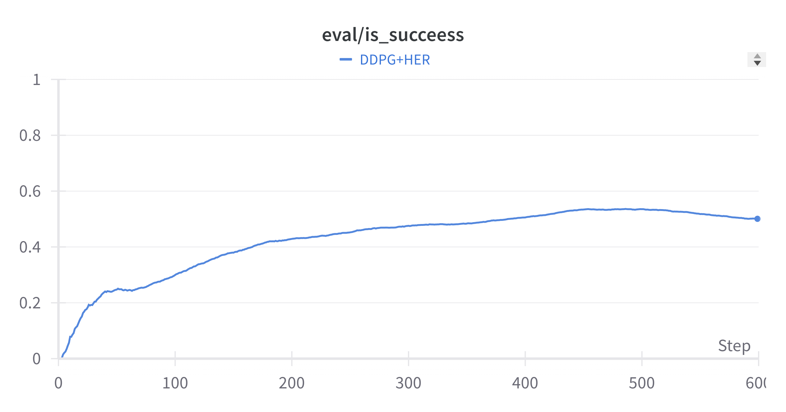

# UR5_FetchPush env

## UR5 FetchPush Gym Environment
This repository contains a custom OpenAI Gym-compatible environment for simulating a robotic manipulation task using the UR5 robotic arm. The task, named "FetchPush," involves the UR5 robot pushing an object to a target location on a flat surface. This environment is designed for research and development in the field of reinforcement learning and robotics.

### Environment Description
In the FetchPush task, the UR5 robot is equipped with a two-finger gripper and is tasked with pushing a puck to a specified goal location. The environment provides a realistic simulation of the robot's dynamics and the interaction with the object.

Key features of the environment include:

Realistic UR5 robot arm simulation with a two-finger gripper. (Thanks to [ElectronicElephant](https://github.com/ElectronicElephant/pybullet_ur5_robotiq) for meshes and visual)

- A puck that the robot must push to the goal.
- Observation space that includes the position and velocity of the robot's joints, the position of the puck, and the target goal position.
- Reward function that encourages the robot to push the puck as close to the goal as possible.
- Configurable initial conditions for the robot's arm and the puck's position.

## TODO List
- [x] Proper Wandb support
- [x] Add plots and demo
- [x] Collect datasets for offline RL methods

### Installation

To install the UR5 FetchPush Gym Environment, follow these steps:
```bash
git clone https://github.com/nikisim/UR5_FetchPush_env.git
pip install -e .
```

### Usage
To use the UR5 FetchPush environment, you can create an instance of the environment and interact with it as you would with any other Gym environment:

```python
import gym
import gym_UR5_FetchPush


env = gym.make('gym_UR5_FetchPush/UR5_FetchPushEnv-v0', render=True)

# Reset the environment
observation = env.reset()

# Sample a random action
action = env.action_space.sample()

# Step the environment
observation, reward, done, info = env.step(action)
```

### Dependencies
This environment requires the following dependencies:

- gym
- numpy
- pybullet (for physics simulation)

Make sure to install these dependencies before using the environment.

## Instruction to train DDPG+HER for UR5_FetchPush
If you want to use GPU, just add the flag `--cuda` **(Not Recommended, Better Use CPU)**.
```bash
mpirun -np 8 python -u train.py --save-dir saved_models/UR5_FetchPush 2>&1 | tee push_UR5.log
```

Check ```arguments.py``` for more info about flags and options

### Play Demo
```bash
python demo.py --demo-length 10
```

### Collect dataset for offline RL
To collect dataset in D4RL format using pretrained DDPG+HER. By default it will collect >800.000 transitions with 'observations', 'actions', 'rewards', 'next_observations', 'terminals'
```bash
python create_dataset.py
```

## Results
### Training Performance
It was plotted by using 600 epochs. 



### Demo:

UR5_FetchPush| 
-----------------------
|
<!-- ## Acknowledgement:
- [Openai Baselines](https://github.com/openai/baselines)

## Requirements
- python=3.5.2
- openai-gym=0.12.5 (mujoco200 is supported, but you need to use gym >= 0.12.5, it has a bug in the previous version.)
- mujoco-py=1.50.1.56 (~~**Please use this version, if you use mujoco200, you may failed in the FetchSlide-v1**~~)
- pytorch=1.0.0 (**If you use pytorch-0.4.1, you may have data type errors. I will fix it later.**)
- mpi4py


## Instruction to run the code
If you want to use GPU, just add the flag `--cuda` **(Not Recommended, Better Use CPU)**.
1. train the **FetchReach-v1**:
```bash
mpirun -np 1 python -u train.py --env-name='FetchReach-v1' --n-cycles=10 2>&1 | tee reach.log
```
2. train the **FetchPush-v1**:
```bash
mpirun -np 8 python -u train.py --env-name='FetchPush-v1' 2>&1 | tee push.log
```
3. train the **FetchPickAndPlace-v1**:
```bash
mpirun -np 16 python -u train.py --env-name='FetchPickAndPlace-v1' 2>&1 | tee pick.log
```
4. train the **FetchSlide-v1**:
```bash
mpirun -np 8 python -u train.py --env-name='FetchSlide-v1' --n-epochs=200 2>&1 | tee slide.log
```

### Play Demo
```bash
python demo.py --env-name=<environment name>
```
### Download the Pre-trained Model
Please download them from the [Google Driver](https://drive.google.com/open?id=1dNzIpIcL4x1im8dJcUyNO30m_lhzO9K4), then put the `saved_models` under the current folder.

## Results
### Training Performance
It was plotted by using 5 different seeds, the solid line is the median value. 

### Demo:
**Tips**: when you watch the demo, you can press **TAB** to switch the camera in the mujoco.  

FetchPush-v1| FetchPickAndPlace-v1| FetchSlide-v1
-----------------------|-----------------------|-----------------------|
| |  -->
